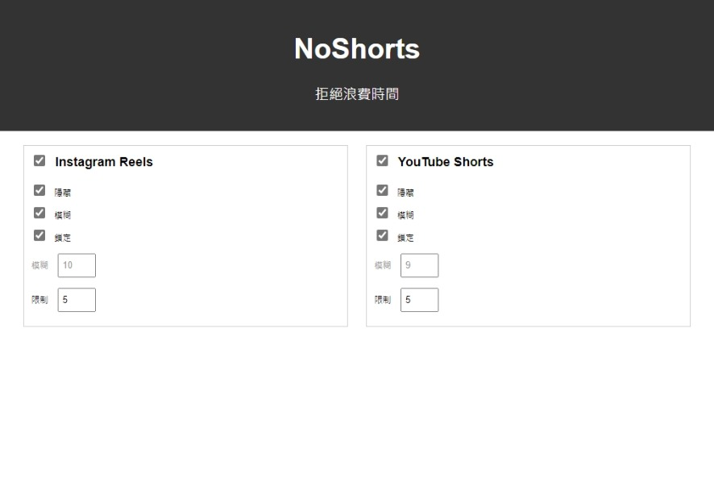

# NoShorts
讓連續短片消失!
###### *version-V1.0* 
---

## 下載&安裝
1.下載資料夾並解壓縮：code -> download ZIP 

2.開啟擴充頁面並打開開發者模式：擴充功能圖示(右上) -> 管理擴充功能 -> 開發人員模式

3.載入擃充資料夾：載入未封裝項目(載入解壓縮) -> 選擇下載的資料夾

4.安裝完成圖標：

## 設定(右鍵點選圖標進入選項頁面)
  
a. 是否啟用：最上方勾選框

b. 隱藏：讓連續短片按鈕消失

c. 模糊：完全封鎖

d. 鎖定：阻止連續滾動(下方限制指最高滾動次數)

e. 截圖：

    

## 更新
- 目前不定期更新需自行至此重新安裝(目前版本1.0)

## 更新日誌
    2024/03/31 (1.0) -> 優化&使用者介面
    2024/03/30 (0.0) -> 核心阻擋功能
  
